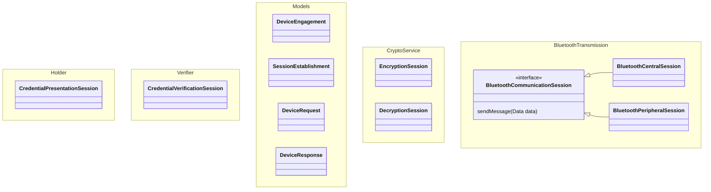

# Mobile | Credential sharing | Android

[](https://github.com/govuk-one-login/mobile-credential-sharing-android/actions/workflows/merge-to-main.yml)
[](https://sonarcloud.io/summary/new_code?id=govuk-one-login_mobile-credential-sharing-android)

This SDK provides an ISO 18013-5 compliant framework for **Holder** (credential sharing) and *
*Verifier** (credential requesting) roles. Consuming applications adopt the role relevant to their
use case (for example, an identity wallet adopts the Holder role, and a relying party app adopts the Verifier
role).

The current implementation includes a demo app and implements ISO 18013-5 for in-person Bluetooth
presentation and verification.

Internal team members can find the team ways of working on Confluence.

## Overview

The SDK implements the ISO 18013-5 specification:

- **Device Engagement:** Generates and scans QR codes, broadcasts and connects over Bluetooth Low Energy (BLE).
- **Session Management:** Establishes secure channels (mdoc session encryption).
- **Message Passing:** Creates, transmits, and parses `DeviceRequests` and `DeviceResponses`.

This repository contains packages for:

- [Bluetooth](./bluetooth): sharing data over Bluetooth
- [Core features](./core): Common capabilities across the code base
- [Holder](./holder): securely share a credential with a verifier
- [Models](./models): representing data models in Concise Binary Object Representation (CBOR) format
- [CryptoService](./crypto-service): encryption and decryption of data for transit
- [Verifier](./verifier): securely receive and verify a credential from a holder

### Credential Provisioning Flow

The user doesn't pre-select a credential prior to session initialisation. The SDK determines the
Verifier's attribute requirements after establishing a secure connection. Data exchange proceeds as
follows:

1. The SDK receives the `DeviceRequest` and queries the Host App via the `CredentialProvider`.
2. The SDK (or Host App) presents the consent UI based on the requested attributes.
3. Following consent, the Host App provides the requested data and cryptographic signatures.

---


## Setup and installation

- The [Documentation] relating to project configuration and developer set up.

[Documentation]: /docs

We recommend that you start by reading the GOV.UK
Wallet [Technical Documentation](https://docs.wallet.service.gov.uk/consuming-and-verifying-credentials)

## Usage

### Integration Guide: Holder Role

The **Host App** adopting the Holder role provisions and stores credentials securely. It acts as the
secure vault, supplying both issuer-signed data and device signatures when a Verifier initiates a
request.

To maintain cryptographic boundaries, the Host App provides the exact CBOR `IssuerSignedItem` bytes
originally signed by the Issuer, and the SDK doesn't sign these attributes. To prove device possession
and bind the credential to the current BLE session, the SDK constructs a `DeviceAuthentication`
payload, which the Host App then signs using the credential's Android Keystore private key. Finally,
the SDK handles all mdoc session encryption for the transport tunnel.

#### 2. Initialise the Holder Module

The Host App initialises the sharing module by injecting the provider.

```kotlin
val credentialProvider = MyCredentialProvider()
val presenter = CredentialPresenter(credentialProvider)
```

#### 3. Start a Sharing Session

The Host App initiates the engagement QR code display. The SDK awaits the Verifier's request,
queries the `CredentialProvider`, and prompts for consent.

```kotlin
// The SDK displays the Device Engagement UI (QR code) and listens for Verifiers.
presenter.startSharingJourney(activity)
```

#### 4. Handling Consent (Optional Customisation)

The SDK provides standard UI for Verifier requests and consent. The Host App can provide a custom
delegate to match its design system.

```kotlin
presenter.consentDelegate = MyCustomConsentUI()
```

---

### Integration Guide: Verifier Role

The **Host App** adopting the Verifier role requests attributes and consumes the verified response.
It acts as the trust anchor, supplying the SDK with the Root Certificates of trusted issuers.

To maintain cryptographic boundaries, the SDK handles the complete transaction lifecycle: it manages
the camera scanner, establishes the secure BLE tunnel, decrypts the `DeviceResponse`, and
cryptographically validates the Issuer's signature and data integrity. The Host App defines the
request and receives the validated data.

#### 1. Initialise the Verifier Module

The Host App initialises the Verifier module, injecting the Root Certificates used to validate the
Issuer's signature on the credential. The SDK utilises an internal `PrerequisiteGate` to resolve
transport availability at runtime.

```kotlin
import com.credentialsharing.sdk.*

// Provide the Root CAs for the issuing authorities you trust
val trustedRoots = listOf(myGovernmentRootCA, myOtherTrustedCA)

val verifier = CredentialVerifier(trustedCertificates = trustedRoots)
```

#### 2. Request Attributes

The Host App defines the `CredentialRequest` up front. This specifies the document type and the
required attributes.

```kotlin
val request = CredentialRequest(
    documentType = "org.iso.18013.5.1.mDL",
    requestedElements = listOf("family_name", "given_name", "age_over_18")
)
```

#### 3. Start Verification & Process Response

The SDK takes control of the flow: it launches the camera, scans the engagement QR code, establishes
the BLE connection, transmits the request, and validates the response. The Host App awaits the
final, cryptographically verified data.

```kotlin
lifecycleScope.launch {
    try {
        // The SDK handles the entire scanning, connection, and validation lifecycle
        val verifiedData = verifier.requestDocument(
            request = request,
            activity = this@MyActivity
        )

        // The SDK has already validated the MSO signature and hash integrity. 
        // The Host App can safely proceed with the verified flow.
        val ageOver18 = verifiedData.getValue("age_over_18") as? Boolean
        val familyName = verifiedData.getValue("family_name") as? String

    } catch (e: Exception) {
        // Handle errors (e.g., user cancelled, invalid signature, connection dropped)
    }
}
```