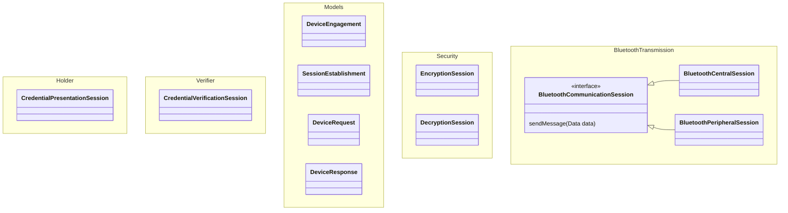

# Mobile | Credential sharing | Android

A reference implementation for sharing and verifying digital credentials.

The current implementation includes a demo app and implements ISO 18013-5 for in-person Bluetooth presentation and verification.

Internal team members can find the team ways of working on Confluence.

## Overview

This repository contains packages for: 

- [Bluetooth](./bluetooth): sharing data over Bluetooth
- [Core features](./core): Common capabilities across the code base
- [Holder](./holder): securely share a credential with a verifier
- [Models](./models): representing data models in Concise Binary Object Representation (CBOR) format
- [Security](./security): encryption and decryption of data for transit
- [Verifier](./verifier): securely receive and verify a credential from a holder

More details coming soon.

## Setup and installation

- The [Documentation] relating to project configuration and developer set up.

[Documentation]: /docs

## Usage

### Using the test app

TBC

### Consuming the SDK

#### For presenting

TBC

#### For verifying

We recommend that you start by reading the GOV.UK Wallet [Technical Documentation](https://docs.wallet.service.gov.uk/consuming-and-verifying-credentials)

TBC
