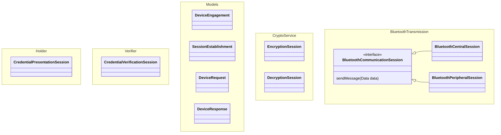

# Mobile | Credential sharing | Android

[](https://github.com/govuk-one-login/mobile-credential-sharing-android/actions/workflows/merge-to-main.yml)
[](https://sonarcloud.io/summary/new_code?id=govuk-one-login_mobile-credential-sharing-android)

This SDK provides an ISO 18013-5 compliant framework for the proceeding roles:

- **Holder** (credential sharing).
- **Verifier** (credential requesting).

Consuming applications adopt the role relevant to their use case. As an
example, an identity wallet adopts the Holder role, and a relying party
app adopts the Verifier role.

The current implementation includes a demo app and implements ISO 18013-5 for in-person Bluetooth
presentation and verification.

Internal team members can find the team ways of working on Confluence.

## Overview

The SDK implements the ISO 18013-5 specification:

- **Device Engagement:** generates and scans QR codes, broadcasts and connects over Bluetooth Low Energy (BLE).
- **Session Management:** establishes secure channels (mdoc session encryption).
- **Message Passing:** creates, transmits, and parses `DeviceRequests` and `DeviceResponses`.

This repository contains packages for:

- [Bluetooth](./bluetooth): sharing data over Bluetooth
- [Core features](./core): common capabilities across the codebase
- [Holder](./holder): securely share a credential with a verifier
- [Models](./models): representing data models in Concise Binary Object Representation (CBOR) format
- [CryptoService](./crypto-service): encryption and decryption of data for transit
- [Verifier](./verifier): securely receive and verify a credential from a holder

### Credential Provisioning Flow

The user doesn't pre-select a credential prior to session initialisation. The SDK determines the
Verifier's attribute requirements after establishing a secure connection. Data exchange proceeds as
follows:

1. The SDK receives the `DeviceRequest` and queries the consumer via the `CredentialProvider`.
2. The SDK (or consumer) presents the consent UI based on the requested attributes.
3. Following consent, the consumer provides the requested data and cryptographic signatures.

---


```mermaid
classDiagram
namespace Holder {
    class CredentialPresentationSession
}

namespace Verifier {
    class CredentialVerificationSession
}

namespace Models {
    class DeviceEngagement
    class SessionEstablishment
    class DeviceRequest
    class DeviceResponse
}

namespace CryptoService {
    class EncryptionSession
    class DecryptionSession
}

namespace BluetoothTransmission {
    class BluetoothCommunicationSession{
        <<interface>>
        sendMessage(Data data)
    }
    class BluetoothCentralSession
    class BluetoothPeripheralSession
}

BluetoothCommunicationSession<|--BluetoothCentralSession
BluetoothCommunicationSession <|-- BluetoothPeripheralSession

```
## Setup and installation

- The [Documentation] relating to project configuration and developer set up.

[Documentation]: /docs

We recommend that you start by reading the GOV.UK
Wallet [Technical Documentation](https://docs.wallet.service.gov.uk/consuming-and-verifying-credentials)

## Usage

### Integration guide: holder role

The **consumer** adopting the Holder role provisions and stores credentials securely. It acts as the
secure vault, supplying both issuer-signed data and device signatures when a Verifier initiates a
request.

To maintain cryptographic boundaries, the consumer provides the exact CBOR `IssuerSignedItem` bytes
originally signed by the Issuer. The SDK doesn't sign these attributes. The SDK constructs
`DeviceAuthentication` payloads to prove credentials as part of binding to the current BLE session.
The Android Keystore signing key signs credentials. Finally, the SDK handles all mdoc session
encryption for the transport tunnel.

**1. Importing the module**

Import the module into Wallet Core using GitHub Packages / Gradle Modules.

**2. Implement the CredentialProvider**

Wallet Core implements the `CredentialProvider` interface to provide the Sharing SDK with access to credentials and signing capabilities:

```kotlin
interface CredentialProvider {
  suspend fun getCredentials(
    request: CredentialRequest
  ): List<Credential>

  suspend fun sign(
    payload: ByteArray,
    documentId: String
  ): SignResult
}
```

The `CredentialRequest` contains an array of document types that the verifier requests:

```kotlin
data class CredentialRequest(
   val documentTypes: List<String>
)

data class Credential(
  val id: String,
  val rawCredential: ByteArray
)
```

Initially `getCredentials` always returns an array of exactly **one** element: the decrypted raw CBOR data for the user's mDL credential.

On success, return `SignResult.Success` with the raw signature bytes. On failure, return
`SignResult.Failure` wrapping a `CredentialSigningException`:

```kotlin
sealed class SignResult {
  class Success(val signature: ByteArray) : SignResult()
  data class Failure(val exception: CredentialSigningException) : SignResult()
}

sealed class CredentialSigningException protected constructor(
  cause: Throwable? = null
) : Exception(cause) {
  class Recoverable(cause: Throwable? = null) : CredentialSigningException(cause)
  class Unrecoverable(cause: Throwable? = null) : CredentialSigningException(cause)
}
```

The SDK recognises two failure outcomes:

- `Recoverable` (For example: the user cancelled local authentication): the session stays active on the
  'Agree to Share' screen with no message sent to the Verifier. The user can retry, deny, or cancel.
- `Unrecoverable`: the SDK terminates the exchange and the journey ends on the Generic Error screen.

**3. Initialise the SDK and create a Presenter**

The consumer initialises the SDK with the app context and a logger, then creates a
`CredentialPresenter` by passing the `CredentialProvider` implementation.

```kotlin
val sdk = CredentialSharingSdkImpl(
  applicationContext = context,
  logger = logger
)

val credentialProvider = MyCredentialProvider()
val presenter = sdk.presentCredentialSdk.presenter(credentialProvider)
```

**4. Present the Share Flow**

The consumer adds the presenter's flow to its view hierarchy, which triggers the sharing journey to start:

```kotlin
ShareCredential(
    component = presenter,
    modifier = Modifier.fillMaxWidth()
)
```

---

### Integration guide: verifier role

The **consumer** adopting the Verifier role requests attributes and consumes the verified response.
It acts as the trust anchor, supplying the SDK with the Root Certificates of trusted issuers.

To maintain cryptographic boundaries, the SDK handles the complete transaction lifecycle:

- Manages the camera scanner
- Establishes the secure BLE tunnel
- Decrypts the `DeviceResponse`
- Cryptographically validates the Issuer's signature and data integrity.

The consumer defines the request and receives the validated data.

**1. Initialise the Verifier Module**

The consumer initialises the Verifier module, injecting the Root Certificates used to validate the
Issuer's signature on the credential. The SDK utilises an internal `PrerequisiteGate` to resolve
transport availability at runtime.

```kotlin
import com.credentialsharing.sdk.*

// Provide the Root CAs for the issuing authorities you trust
val trustedRoots = listOf(myGovernmentRootCA, myOtherTrustedCA)

val verifier = CredentialVerifier(trustedCertificates = trustedRoots)
```

**2. Request Attributes**

The consumer defines the `CredentialRequest` up front. This specifies the document type and the
required attributes.

```kotlin
val request = CredentialRequest(
    documentType = "org.iso.18013.5.1.mDL",
    requestedElements = listOf("family_name", "given_name", "age_over_18")
)
```

**3. Start Verification & Process Response**

The SDK takes control of the flow:

- Launches the camera
- Scans the engagement QR code
- Establishes the BLE connection
- Transmits the request
- Validates the response.
- Then, the consumer awaits the final, cryptographically verified data.

```kotlin
lifecycleScope.launch {
    try {
        // The SDK handles the entire scanning, connection, and validation lifecycle
        val verifiedData = verifier.requestDocument(
            request = request,
            activity = this@MyActivity
        )

        // The SDK has already validated the MSO signature and hash integrity. 
        // The consumer can safely proceed with the verified flow.
        val ageOver18 = verifiedData.getValue("age_over_18") as? Boolean
        val familyName = verifiedData.getValue("family_name") as? String

    } catch (e: Exception) {
        // Handle errors (e.g., user cancelled, invalid signature, connection dropped)
    }
}
```
